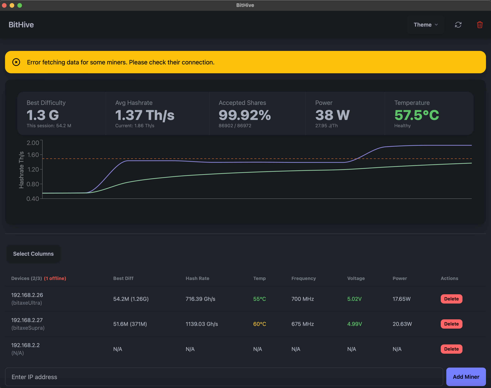

# BitHive

BitHive is a cross-platform desktop application built with Tauri, Next.js, and React. It combines the power of a Rust backend with a modern React frontend to deliver a fast and efficient developer tool.

## Features

- Cross-platform support (macOS, Windows, Linux)
- Built with Tauri for a lightweight and secure desktop application
- Modern web technologies (Next.js, React) for the frontend
- Tailwind CSS and DaisyUI for styling
- React Query for efficient data fetching and state management
- Recharts for data visualization

